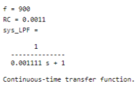

# Signal_Filtering
Separation of one analog signal and 4 digital signals (10 bits each) which  are transmitted simultaneously.

By using a **lowpass filter** I separated the noise from the data. Afterwards, by using a **bandpass filter**, I separated the analog signal from the rest. I find the answer to the filters by using **lsim** command in MATLAB:

First, I plotted the signal from the Hw1_sig file for 0-20 seconds as below:


Then, by applying a low pass filter I removed the effect of **noise** on the signal:

```ruby
sys_LPF = tf(1,[RC 1]);
[y_filtered, t_filtered] = lsim(sys_LPF,u,t);
```

The results are as follows:




I improved the lowpass filter by changing the RC values in the LPF in a for loop as below. By increasing the RC value, noise is removed much more.

```ruby
for i=1:5
  f_temp = f + i;
  RC_temp = 1 / f_temp;
```

The results are as follows:


Then, I designed a bandpass filter to separate the signal with 5Hz frequency (the **analog signal**) using the **tf** command in MATLAB as below:

```ruby
RhCh = 1 / fl
RlCl = 1 / fh
sys_BPF = tf([RhCh, 0],[RhCh * RlCl, RhCh + RlCl, 1]);
[y_BPF, t_BPF] = lsim(sys_BPF,y_filtered,t_filtered);
```

The results are as below:


The **bode diagram** for surveying the amplitude:

```ruby
bodemag(k*sys_BPF, magnitude_change)
```

The graphs are as follows:


I also used an **exponential filter** to get the signal at 100Hz more exclusively:

```ruby
for n=1:10
  bodemag((sys_BPF^n), magnitude_change)
```

The result is as below:


The filter's output for the input y:


As it can be seen, the above signal can be read as **1101111110**.

I repeated the above steps for a signal with a **900 Hz** frequency:

**The signal:**


**The bode diagram:**


**The exponential filter:**


**The filter's output for the input y:**


As it can be seen, the above signal can be read as **0111100111**.

Next, I designed a **highpass filter** as below:

```ruby
sys_HPF = tf(RC,[RC 1]);
[y_filtered, t_filtered] = lsim(sys_LPF,u,t);
```

The filtered signal is as follows:


As the final part of this project, I implemented a **notch filter** in MATLAB as below:

```ruby
sys_notch = tf([LC 0 1],[LC CR 1]);
[y_notch, t_notch] = lsim(sys_notch,y_filtered,t);
```


